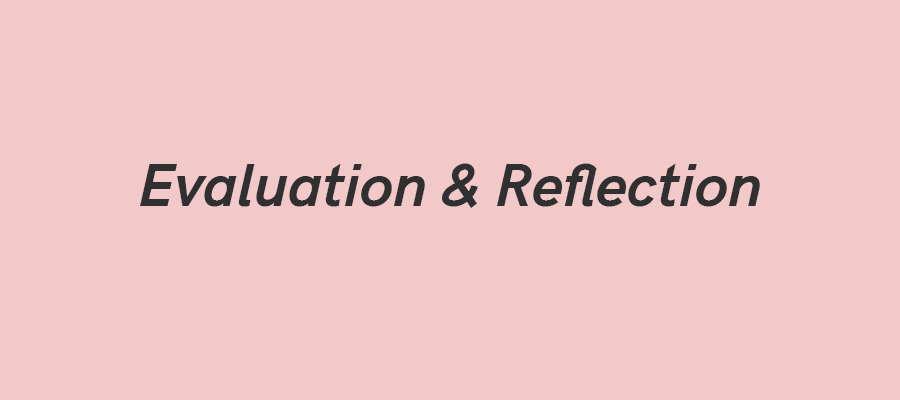

# Week 7

### Today, Monday 13th November 2017

* Mini-lessons
* Install Wordpress / Find themes & Plug-ins
* Collectively create assessment criterion to critique each others work
* Evaluate each others design accordingly to those criteria's

### Your [homework](#homework) and [blog](#blog)!

### Learning Goals for this session

### Goals

* To get an in-depth understanding of how SEO is applied
* To broadly understand how SEO is changing
* The get an introduction to the history of search
* How to install Wordpress on their hosting
* How to work with plug-ins in Wordpress
* Collectively create assessment criterion to evaluate each others design

### Mini-lessons

Who | What
--- | -----------
Callum Peyman Milton | What is the history of search online?
Mayur Micheal | What is SEO? What is SEO not?
Dominic Richardo | What is the Long Tail?
Emma Jacob | Why are 'keywords' important in SEO?
Kevin Muhammad Kaleshe | Why are 'backlinks' important in SEO?

### Install Wordpress / Themes/ Plug-ins

### Create criterion to critique each others work

### Some ideas

* User friendliness
* Colour choices
* The use of typography
* Is the website doing what it is meant to?
* Is the website designed for its target audience?

**Can you think of more criterion?**

### Evaluate each others design accordingly to those criteria's

### Change your designs according to feedback.

### Homework

Who | What
--- | -----------
Callum Mayur| Why does it matter to have a good site architecture for SEO? (Think google crawlers)
Micheal Dominic | What it the optimal site load? Why does it matter for SEO?
Muhammad Richardo Milton  | For optimal SEO, what should your URL look like?
Emma Kaleshe Peyman | What is the optimal title length and where should the keyword be placed?
Kevin< Jacob | How long should the body text be at least? How many times should you use keywords?

### Blog

How are you going to use SEO to extend the reach of your Image Library? Give some examples.
