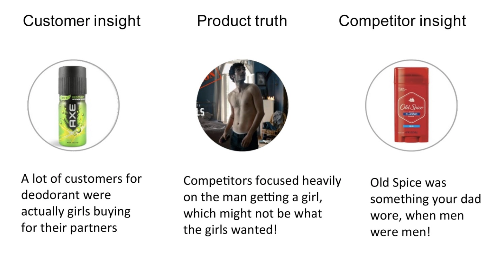

# Week 8

### Today, Monday 20th November 2017

* Peer-to-peer mini-lesson
* Create and present in class peer-to-peer mini-lesson
* Workshop
* Tutorials

## Goals for this session

**Learning goals**

* A furthered understanding of SEO & keywords
* Investigate the role of social media

## Peer-to-peer Lecture

Who | What
--- | -----------
Callum Mayur | Why does it matter to have a good site architecture for SEO? (Think google crawlers)
Micheal Dominic | What it the optimal site load? Why does it matter for SEO?
Muhammad Richardo Milton  | For optimal SEO, what should your URL look like?
Emma Kaleshe Peyman | What is the optimal title length and where should the keyword be placed?
Kevin Jacob | How long should the body text be at least? How many times should you use keywords?

## In class mini-lecture

Who | What
--- | -----------
Micheal Dominic | What is no-follow and dofollow?
Muhammad Richardo Milton  | What is a good example of content marketing?
Emma Kaleshe Peyman | What is black hat and white hat SEO?
Kevin Jacob | How often and when should you post on Social Media?
Callum Mayur | What does a good social media profile look like?

## Workshop

### Create a 3 examples of content marketing for your image library

> **Your message should be based around**

* Customer insight
* Product truth
* Competitor insight

## Tutorials

Group tutorials

## Homework

Prepare for summative next week.

## Blog

Explore good examples of good social media marketing. Analyse at least three pieces of work and then blog about them.
